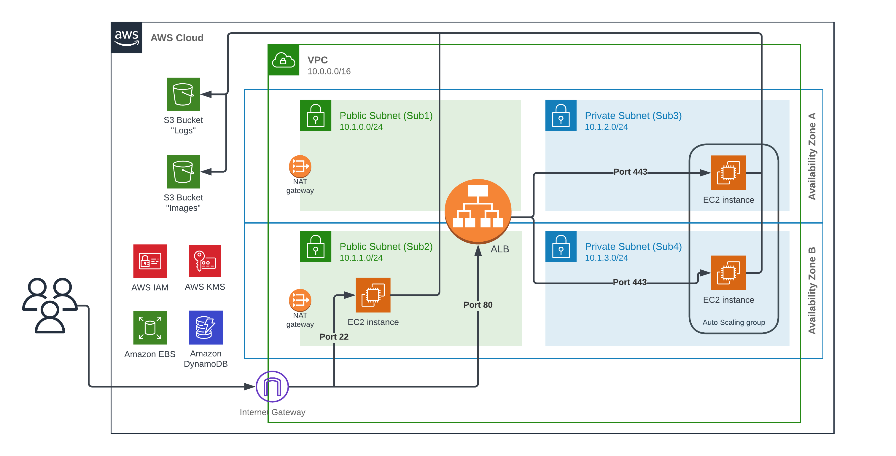
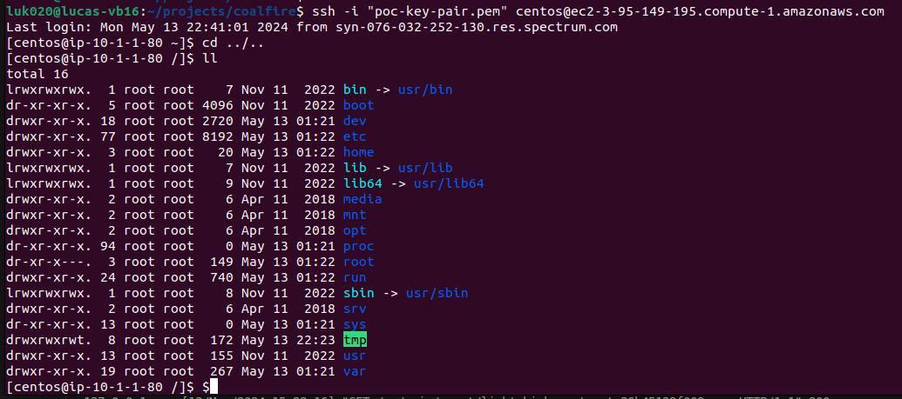

> [!NOTE]  
> The documentation on the project architecture and the proposed scenario are in [README.md](README.md)

## Requirements Checklist

### Top-level Deliverables

✅ Working Terraform code in a public GitHub repository
- https://github.com/lsousadev/coalfire/tree/v1.0/terraform

✅ The URL of your GitHub repository
- https://github.com/lsousadev/coalfire/tree/v1.0

✅ An architecture diagram
- 
- https://github.com/lsousadev/coalfire/blob/v1.0/coalfire_architecture.png

✅ A document describing your solution, which includes your screenshot and cites any references used
- https://github.com/lsousadev/coalfire/tree/v1.0/SOLUTION.md

✅ A functional README for your repository
- https://github.com/lsousadev/coalfire/tree/v1.0/README.md

✅ Screenshot of the terminal logged into stand-alone EC2 instance
- 
- https://github.com/lsousadev/coalfire/blob/v1.0/coalfire_ec2_screenshot.png

### Detailed Instructions

✅ 1 VPC - 10.1.0.0/16
- https://github.com/lsousadev/coalfire/blob/v1.0/terraform/2-network/main.tf#L1-L8
- https://github.com/lsousadev/coalfire/blob/v1.0/terraform/2-network/variables.tf#L19-L23

✅ 4 Subnets - 10.1.0.0/24 (Public), 10.1.1.0/24 (Public), 10.1.2.0/24 (Private), 10.1.3.0/24 (Private)
- https://github.com/lsousadev/coalfire/blob/v1.0/terraform/2-network/main.tf#L12-L13
- https://github.com/lsousadev/coalfire/blob/v1.0/terraform/2-network/variables.tf#L31-L47

✅ 1 EC2 - t2.micro, Red Hat Linux, 10.1.1.0/24 subnet, 20 GB storage
- https://github.com/lsousadev/coalfire/blob/v1.0/terraform/3-compute/ec2-sub2.tf#L49-L64
- https://github.com/lsousadev/coalfire/blob/v1.0/terraform/3-compute/variables.tf#L19-L35
- https://github.com/lsousadev/coalfire/blob/v1.0/terraform/3-compute/data.tf#L31-L55

✅ 1 ASG - t2.micro, Red Hat Linux, private subnets, 20 GB storage, 2-6 hosts, Apache installed, IAM role with access to "Images" bucket
- https://github.com/lsousadev/coalfire/blob/v1.0/terraform/3-compute/asg.tf#L26-L85
- https://github.com/lsousadev/coalfire/blob/v1.0/terraform/3-compute/user_data.sh
- https://github.com/lsousadev/coalfire/blob/v1.0/terraform/3-compute/ec2-sub2.tf#L1-L24

✅ 1 ALB - port 80, forward to ASG port 443
- https://github.com/lsousadev/coalfire/blob/v1.0/terraform/3-compute/alb.tf#L26-L65

✅ SGs for necessary traffic
- https://github.com/lsousadev/coalfire/blob/v1.0/terraform/3-compute/ec2-sub2.tf#L72-L79
- https://github.com/lsousadev/coalfire/blob/v1.0/terraform/3-compute/asg.tf#L1-L24
- https://github.com/lsousadev/coalfire/blob/v1.0/terraform/3-compute/alb.tf#L1-L24

✅ IAM role to write to log bucket from all EC2s
- https://github.com/lsousadev/coalfire/blob/v1.0/terraform/3-compute/ec2-sub2.tf#L26-L47
- https://github.com/lsousadev/coalfire/blob/v1.0/terraform/3-compute/ec2-sub2.tf#L66-L69
- https://github.com/lsousadev/coalfire/blob/v1.0/terraform/3-compute/asg.tf#L37-L39

✅ 1 bucket "Images" - "Archive" folder, "Memes" folder that moves objects older than 90 days to glacier
- https://github.com/lsousadev/coalfire/blob/v1.0/terraform/1-storage/buckets.tf#L1-L30

✅ 1 bucket "Logs" - "Active" folder that moves objects older than 90 days to glacier, "Inactive" folder that deletes objects older than 90 days
- https://github.com/lsousadev/coalfire/blob/v1.0/terraform/1-storage/buckets.tf#L32-L75

## Extended notes

### General

- Six Coalfire "terraform-aws" repos were used for the project, and the "Coalfire-AWS-RAMPpak" repo provided helpful guidance in using those repos.
- In order to do a proper job and sometimes simply to make the Coalfire repos work, I dove into the code quite frequently and deeply. A lot of digging through modules' inputs and outputs. I noticed a couple of code (not documentation) bugs that helped fix and one that I fixed myself.
- I also spent a good percentage of my time in the Terraform Registry analyzing the various AWS resources used. https://registry.terraform.io/providers/hashicorp/aws/latest/docs
- There were only a couple of times that I got stuck for more than a few minutes and took longer to figure out. I'll expand on those below.
- The Terraform code is divided into four separate directories: "0-account", "1-storage", "2-network", and "3-compute". I did this to make the code more readable and resilient.
- One should be able to `tf init` and `tf apply` seamlessly through each of the Terraform directories in less than 10 minutes without any code changes (making basic assumptions of having an AWS account and being credentialed). The only exception is that due to the "0-account" directory creating the Terraform state bucket, after `tf apply`, "backend.tf" must be uncommented, and the command `tf init -migrate-state` must be run.

### 0-account

- As detailed above, the main detail about this directory is that it creates the Terraform state bucket. Therefore, it must be re-initialized to migrate the local state to S3. I believe this is the best way to go about this type of situation, and it is advised in the "Coalfire-AWS-RAMPpak" repo as well.

### 1-storage

- The main issue I encountered for this directory was the lifecycle configuration rules. In the Coalfire "terraform-aws-s3" repo, creating a rule based only on a prefix (and no tags) caused XML malformation when running `tf apply`. It took some troubleshooting to scope down the issue and find the relevant code. I pushed a fix for this bug.
- The requirement to allow ALB to write to the Logs bucket posed a fun wrinkle. It required a bucket policy where the Principal is the specific AWS account for ALB in its respective region. Moreover, it only works with SSE-S3, not SSE-KMS. https://docs.aws.amazon.com/elasticloadbalancing/latest/application/enable-access-logging.html

### 2-network

- There were plenty of extra inputs to mind with the VPC module, but the only problem I ran into was that the module is inconsistent in how it handles the creation of subnets. Private subnets specifically rely on tags for naming while public subnets don't. I raised the issue of some other inconsistencies as well, but some of these choices seem to be "the least of two evils."

### 3-compute

- The requirements say to use "Red Hat Linux", so I opted for CentOS as RHEL is subscription-based.
- I ran into a very vague AWS error regarding the instance creation, only to eventually find out that the Coalfire repo "terraform-aws-ec2" by default enables ebs optimization, which isn't available with "t2.micro". I couldn't find this answer anywhere, but various StackOverflow pointed to it possibly being an unsupported feature. The issue was that I hadn't passed that variable to begin with, so it took me a while to find that in the code and narrow it down to it being the problem.
- Due to how the Coalfire VPC module is coded, the best way to utilize the outputs from that module rather than fully hardcoding things was to pass the subnet names as variables. This is the most "manual" aspect out of all the scripts.
- I had never created an SSH key via Terraform before, so I opted to handle EC2 keys that way for this project. https://stackoverflow.com/questions/49743220/how-to-create-an-ssh-key-in-terraform
